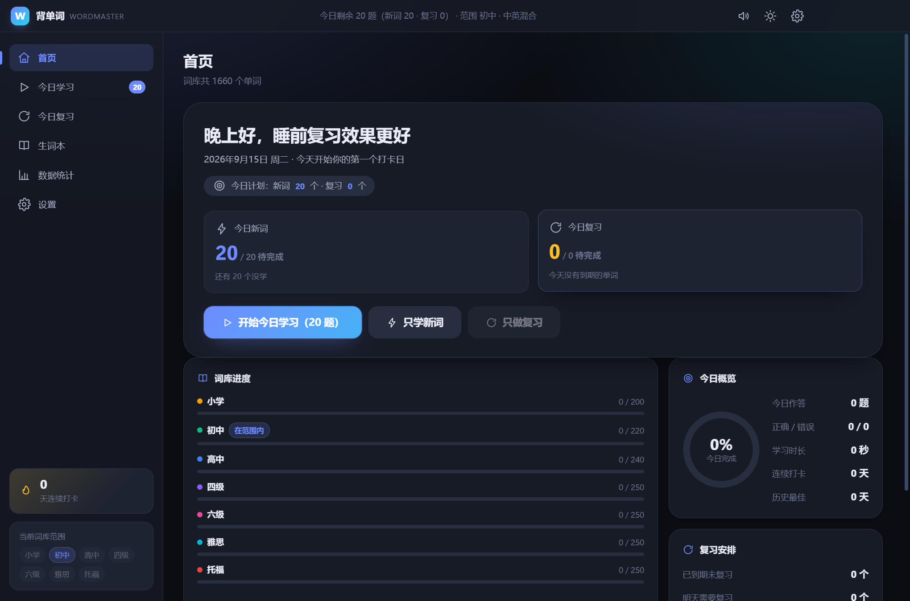
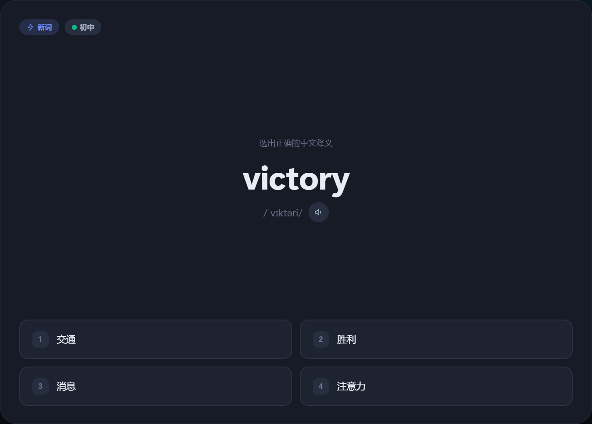
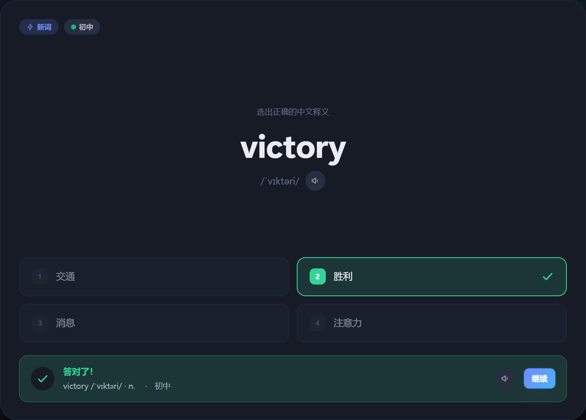
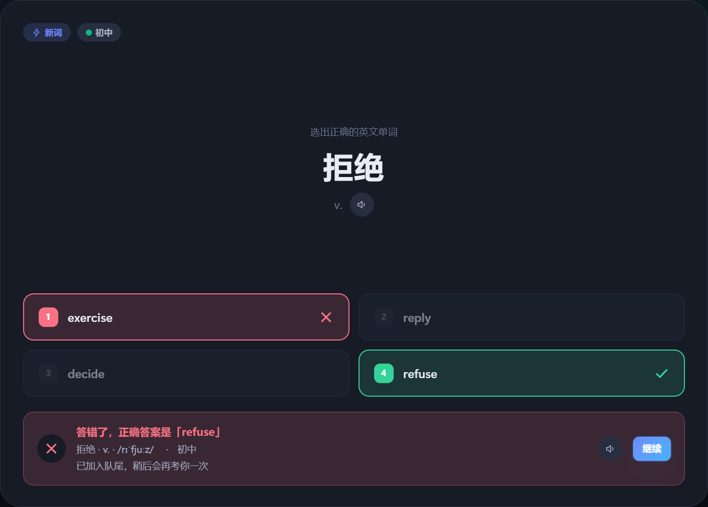
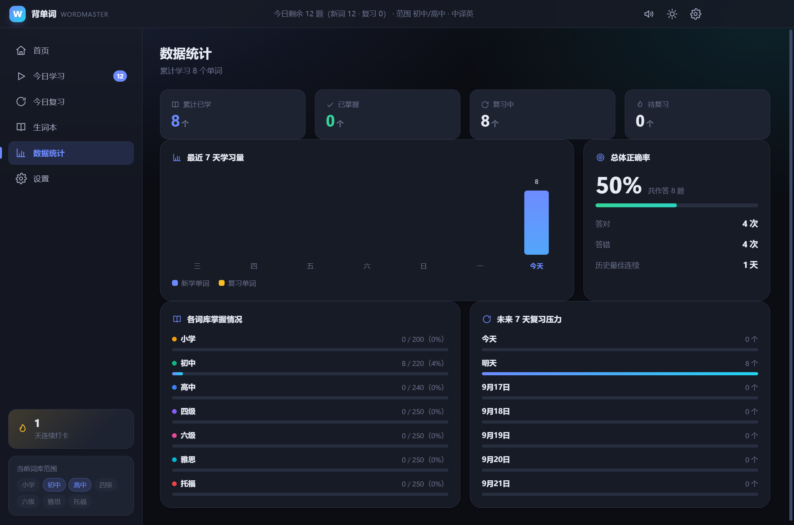
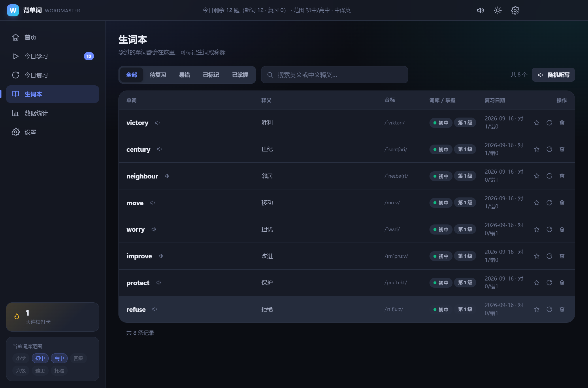

# 背单词 WordMaster

一个离线可用的 Windows 桌面背单词应用。7 个词库等级自由组合、中英双向选择题、对错音效、明暗主题切换，并内置艾宾浩斯式复习调度——**今天背的单词，明天一定会重新考你**。

<!-- 界面截图见 build/shots/ 目录（由 npm run capture 自动生成） -->

---

## 界面预览



<table>
<tr>
<td width="50%"><br><sub>中译英选择题 · 四选一</sub></td>
<td width="50%"><br><sub>答对：绿色高亮 + 上行音效</sub></td>
</tr>
<tr>
<td><br><sub>答错：标出正确答案，并稍后重考</sub></td>
<td><br><sub>学习曲线与正确率统计</sub></td>
</tr>
<tr>
<td><br><sub>生词本：可搜索、标记、移除</sub></td>
<td><br><sub>白色主题（一键切换）</sub></td>
</tr>
</table>


---

## 一、需求对照

| 你的要求 | 实现方式 |
| --- | --- |
| 可自由选择范围：小学 / 初中 / 高中 / 雅思 / 托福 / 四六级 | 「设置 → 词库范围」7 个词库卡片**多选**，另有「全选 / 只选国内学段 / 只选留学考试」快捷按钮。共 1660 词 |
| 同时涵盖中英文的背诵 | 三种出题方向：**英译中**、**中译英**、**中英混合**。中译英题目答完后自动朗读英文，音形义一起记 |
| UI 整体可自由选择白色和黑色 | 标题栏一键切换，设置页有带预览图的主题卡片。切换即时生效，**连系统标题栏按钮配色一起变** |
| 采用选择题方式 | 四选一，键盘 `1~4` / `A~D` 直接作答；干扰项优先取同等级同词性，难度不跳档 |
| 答对、答错都有相应音效 | 用 Web Audio 实时合成：答对是清脆的上行双音，答错是低沉的下行滑音。另有「一组学完」「全对」的收尾音 |
| 可选择一天背诵的单词数量 | 滑块 5~200，另有 10/15/20/30/50/80 快捷档 |
| 第二天复习第一天背的单词 | 学完即排入次日复习；答对间隔按 **1→2→4→7→15→30 天**递增，答错直接退回明天重来 |

额外附带：生词本、数据统计与学习曲线、连续打卡、系统语音朗读、数据导出/导入备份、错题自动重练。

---

## 二、快速开始

### 方式一：直接运行绿色版（推荐，无需安装）

```
release\WordMaster\背单词 WordMaster.exe
```

双击即可。想放桌面就双击同目录下的 `创建桌面快捷方式.bat`。整个文件夹可以拷到 U 盘。

### 方式二：安装包

运行 `release\installer\WordMaster-Setup-1.0.0.exe`，可自选安装目录，会创建桌面和开始菜单快捷方式。

### 方式三：从源码运行

```bash
npm install          # 安装 Electron
npm start            # 启动应用
```

---

## 三、目录结构

```
WordMaster/
├─ main.js                    Electron 主进程：窗口、主题化标题栏、菜单、导入导出
├─ preload.js                 上下文隔离桥，只暴露白名单能力
├─ electron-builder.yml       安装包打包配置
├─ src/
│  ├─ index.html              页面骨架 + SVG 图标精灵
│  ├─ styles.css              设计令牌与全部样式（明暗双主题）
│  ├─ js/
│  │  ├─ util.js              DOM 构建、日期、可复现随机数、提示条、模态框
│  │  ├─ sound.js             Web Audio 音效合成 + 系统语音朗读
│  │  ├─ store.js             状态持久化与数据校验、导入导出
│  │  ├─ bank.js              词库索引、学习计划、复习调度（核心算法）
│  │  ├─ quiz.js              选择题生成与干扰项筛选
│  │  ├─ study.js             学习会话控制器：答题流程、音效、错题重练、结算
│  │  ├─ views.js             首页 / 生词本 / 统计 / 设置 四个页面
│  │  └─ app.js               引导、路由、主题、跨天检测、全局快捷键
│  └─ data/
│     ├─ *.json               7 份词库源文件（可自行增删改）
│     └─ words.js             由 JSON 自动汇总生成，应用实际加载它
├─ tools/
│  ├─ build-data.js           汇总词库 → words.js
│  ├─ verify-words.js         词库质量校验
│  ├─ selfcheck.js            词库完整性 + 出题可行性自检
│  ├─ test-scheduling.js      复习调度无头测试（36 项断言）
│  ├─ make-icon.js            用纯 Node 生成 PNG/ICO 图标
│  ├─ capture.js              自动截图各页面（视觉验证用）
│  └─ build-portable.js       生成免安装绿色版
├─ docs/screenshots/          README 用的界面截图
├─ build/                     图标与截图产物（截图不入版本库，图标入）
├─ release/                   打包输出（体积大，不入版本库）
└─ LICENSE                    MIT 许可证
```

---

## 四、复习算法

采用简化的 Leitner 盒子模型：

```
新词学完            → 等级 0，次日复习
复习答对            → 等级 +1，间隔 1 → 2 → 4 → 7 → 15 → 30 天
复习答错            → 回到等级 0，明天重来
等级到达 5          → 标记「已掌握」，不再进入复习队列
```

几个刻意设计的行为：

- **次日必复习**：新词无论当天答对与否，都排进第二天，这是需求的核心。
- **错题重练不干扰计划**：同一单词当天第二次作答只累计对错，不改复习日期，避免"多试几次就跳过了"。
- **计划当天稳定**：一天之内刷新、重启、来回切页面，队列顺序都不会变；只有改词库范围或数量才会重排。
- **复习上限**：默认每天最多 60 个，积压太多时可在设置里调高。
- **多词库均衡**：同时选多个等级时，新词按等级轮流取，不会一整组都是同一个词库。

这些行为全部有自动化测试覆盖，见 `tools/test-scheduling.js`（36 项断言，包含"第二天队列正好是第一天那 20 个词"）。

---

## 五、词库与自定义

| 等级 | 词数 | 侧重 |
| --- | --- | --- |
| 小学 | 200 | 人教版小学核心词 |
| 初中 | 220 | 中考大纲高频词 |
| 高中 | 240 | 高考高频词 |
| 四级 | 250 | CET-4 核心词 |
| 六级 | 250 | CET-6 核心词 |
| 雅思 | 250 | IELTS 学术与话题词 |
| 托福 | 250 | TOEFL 学术讲座词 |

每条词的结构：

```json
{ "en": "abandon", "zh": "放弃", "pos": "v.", "ipa": "/əˈbændən/" }
```

**自己加词**：编辑 `src/data/<等级>.json`，然后执行

```bash
npm run verify      # 校验格式（重复、缺字段、词性、音标格式）
npm run build:data  # 重新生成 words.js
```

校验会拦住同一文件内英文或中文释义重复的情况——那会让选择题出现两个正确答案。

---

## 六、验证与测试

```bash
npm run check       # 一键跑完：词库校验 → 构建 → 自检 → 调度测试
npm test            # 复习调度无头测试（36 项）
npm run selfcheck   # 词库完整性 + 1660 词 × 2 方向都能出 4 个不重复选项
npm run capture     # 自动截图 23 张到 build/shots/，并做可交互性审计
```

### 关于 `npm run capture` 的可交互性审计

这个工具会用 Electron 真实渲染应用，模拟操作走完答题流程，并且**点击一律使用真实的鼠标输入事件**
（`webContents.sendInputEvent`），而不是 `element.click()`。

这一点很关键：`element.click()` 会绕过浏览器的命中测试，即使界面上盖了一层全屏遮罩、鼠标根本点不到，
它依然"点得动"。开发期就因此漏掉过一个严重 bug —— `.modal-host { display: grid }` 覆盖了浏览器默认的
`[hidden] { display: none }`，导致模态遮罩从启动第一帧就铺满全屏，既挡住所有鼠标点击，又给整个界面
蒙上 58% 黑幕和 4px 高斯模糊。

所以审计包含两部分：

1. **全屏浮层扫描**：找出所有铺满视口、又没有 `pointer-events: none` 的定位元素。
2. **命中测试**：对关键控件用 `document.elementFromPoint()` 确认鼠标真能点到它。

并且带一个**自检金丝雀**：先故意注入一个全屏遮罩，确认检测器能把它报出来——否则"0 个问题"这个结论
本身就没有意义。改动界面后建议跑一次。

```bash
# 也可以指向已打包的目录，验证发布产物本身
set WM_APP_DIR=release\WordMaster\resources\app
set WM_SHOT_DIR=build\shots-packaged
npx electron tools\capture.js
```

---

## 七、快捷键

| 按键 | 作用 |
| --- | --- |
| `1~4` / `A~D` | 选择答案 |
| `Enter` / `空格` | 继续下一题 |
| `S` | 朗读当前单词 |
| `Esc` | 退出学习（会确认） |
| `1~6`（非学习页） | 依次切换：首页 / 学习 / 复习 / 生词本 / 统计 / 设置 |
| `Ctrl+E` / `Ctrl+I` | 导出 / 导入备份 |
| `F11` / `F12` | 全屏 / 开发者工具 |

---

## 八、数据存储

- 学习记录保存在 `%APPDATA%\WordMaster\`，纯本地，不联网、不上传。
- 「设置 → 数据管理」可导出 JSON 备份，换电脑时导入即可继续。
- 卸载时不会删除数据；需要彻底清空就用设置里的「清空数据」。

---

## 九、技术选型说明

- **Electron + 原生 HTML/CSS/JS**：不用任何前端框架和打包器，源码即产物，改一行刷新就生效，也方便你以后自己改。
- **音效用 Web Audio 实时合成**：不依赖任何音频文件，所以永远不会出现"打包后音效丢失"的问题。
- **词库编译成 `words.js`**：页面以 `file://` 加载，浏览器安全策略禁止 `fetch` 读本地 JSON、也禁止 ES module 跨文件导入，把词库汇总成普通脚本是最稳的做法。
- **图标用纯 Node 生成**：自己实现了 PNG 编码（zlib + CRC32）和 ICO 封装，不引入第三方图形库。
- **手动便携版打包**：不依赖 electron-builder 下载额外二进制，`tools/build-portable.js` 直接把 Electron 运行时改名复用，全程离线可复现。
